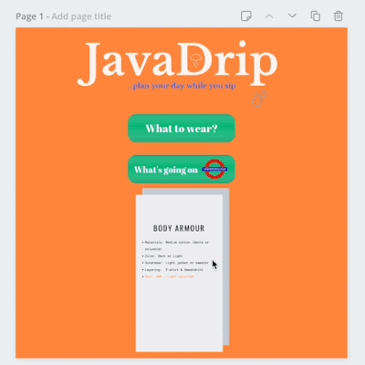
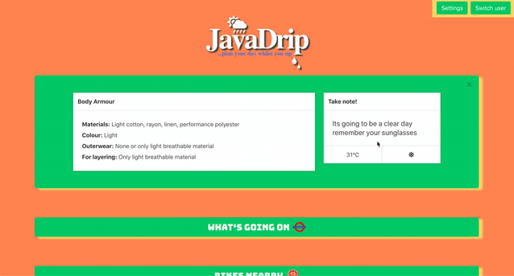
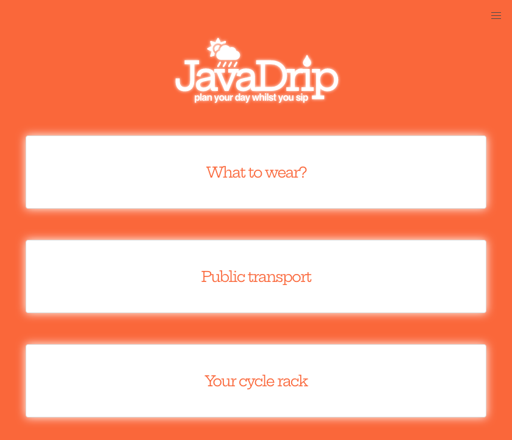
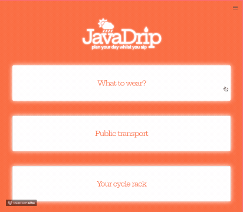

# JavaDrip

## Plan your day while you sip

The idea for the app came from a discussion about how to start your day well and make sure there were no nasty surprises on the way to work. The premise was to build an app that would give a quick morning briefing to start your day in the best way.

We settled on an MVP which would:
* advise the best clothes for the user to wear based on the current weather forecast
* also give a weather snapshot 
* advise on the current travel conditions 

All of this would sit in a simple and clean user interface.

The first version of this app was built over two days as part of a two person team, with a subsequent version being finalised as a solo project by myself.

## Built With

* [React](https://reactjs.org/)
* [Bulma](https://bulma.io) - CSS Framework

## Contributors
I was one member of a team of two who created the initial release
* [**Cliff Conolly**](https://github.com/Cliff-Conolly/sei-Javadrip) - *v1.0*
* **Me** - *v1 onwards*

## Major Achievements
The parts of the project I am most proud of are:
* The way the design of the app considers the loading speed of the different APIs involved. Rather than trigger all the required APIs in one go, each API is requested once the user selects the section they would like to expand
* The deployment. Previously I had always deployed React applications to the main directory on a server. For hosting this site within my portfolio, I needed to adapt the app to work correctly from a sub-domain (on GitHub pages). This needed changes to the BrowserRouter configuration and the Webpack config. I applied these changes by researching the issue myself. 

## Design process
As this was a team project, it was very important to ensure we were moving towards the same goal. After using a mind map to generate ideas, we created a design mockup in Canva to settle on an approach which we could each envisage.

**Design drawings**



**Version 1 (MVP)**



**Version 2**



## API selection
To achieve the desired functionality, the team selected four APIs to use:

API | App component | Description | Documentation
--- | --- | --- | ---
[Open Weather](https://api.openweathermap.org/data/2.5/weather) | What to wear | Open Weather
[TfL Tube status](https://api.tfl.gov.uk/line/mode/tube/status) | Public Transport | TfL Tube status
[TfL Bikepoint](https://api.tfl.gov.uk/bikepoint) | Cycle Rack | Open Weather
[Postcode.io](https://api.postcodes.io/postcodes/) | Settings | Resolves a set of lat/long coordinates from a postcode


## Functionality

### User Journeys
Journey A - first time access
1. User chooses and saves location and name
2. JavaDrip home (all sections minimised)

Journey B - returning user
1. JavaDrip home (all sections minimised)

Journey C - user wants to change location
1. User chooses to switch cities  (future capability: detect current location based on browser location API)
2. User chooses and saves location
3. JavaDrip home (all sections minimised)


### the JavaDrip
In the initial state, three small tiles appear, and when clicked will expand



Each section had its own challenges. See below for a summary of each section.

#### What to wear
When clicked, the state changes, and expands to include:
* Default the location to London (if no location was provided)
* Use the location to fetch the next morning's weather from the OpenWeatherMap API
    ```
    axios.get(`https://api.openweathermap.org/data/2.5/weather?q=${city},uk&units=metric&APPID=${process.env.APPID}`)
      .then( ({ data }) => {
        const weather =  this.extractWeatherData(data)
        const recco = this.whatToWearRules(weather)
        this.setState({ recco, data })
      })
      .catch(err => console.log(err))
    ```
    This shows the step-by-step processing of the data once it has been received. It is fed into a data extraction function which strips away the data not required by the rules (it only keeps the temperature and the immediate forecast data):
    ``` 
    extractWeatherData(data){
        const temp =  data.main.temp
        const id = data.weather[0].id
        return {temp, id}
    }
    ```
* Run the rules on the weather data to determine the clothes the user should wear:
    - Select the advice based on the temperature segment (-30 to 10, 10 to 20, 20 to 30, 30+)
    - Detect a special weather condition:
        - 'There might be rain so take an umberella'
        - 'Its going to snow, so remember your wellies!'
        - 'Take care, there will be low visibility'
        - 'Its going to be a clear day remember your sunglasses'
        - 'Wear something bright to cheer yourself up, its going to be a cloudy day!'
* Save the recommendations into state along with the weather data - that retriggers the render
* Render the recommendation in the component

#### Public transport
When clicked, the state changes, and expands to include:
* Shows a breakdown of each TfL tube line, and a summary of whether there is a good / bad service
* Each can be clicked to see a more detailed description of the status

#### Your cycle rack
When clicked, the state changes, and expands to include:
* Using the users saved lat/long from local storage and a default radius (1000m), assess which is the closest bike point using the TfL Bikepoint API, and then display:
    - The location description
    - The number of available bikes
    - The number of free bike slots

### The location / user switching
* Asks the user to provide a city location from a dropdown, and also to enter a postcode
* If the user chooses to provide a postcode, once save is clicked, verify the postcode using Postcodes.io, and use the API to resolve the postcode into a set of lat/long coordinates. Warn the user if the postcode cannot be resolved, and prompt the error to them
* Save the users home city, postcode and lat/long coordinates into local storage as an object 


## Versioning

#### v1.0
[JavaDrip version 1](https://tomtidswell.github.io/sei-javadrip/)
One week project, ended with a demo and presentation. MVP was complete.

#### v2.0
* improved and modernised the styling
* upgraded weather API to https
* cleaner interface, removed unnecessary images
* standardised the fonts
* fixed font-rendering on mobile
* _...in progress_

